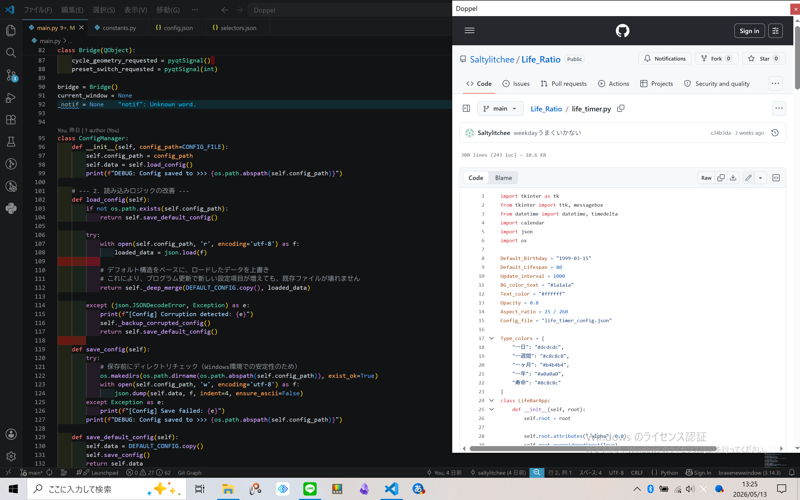
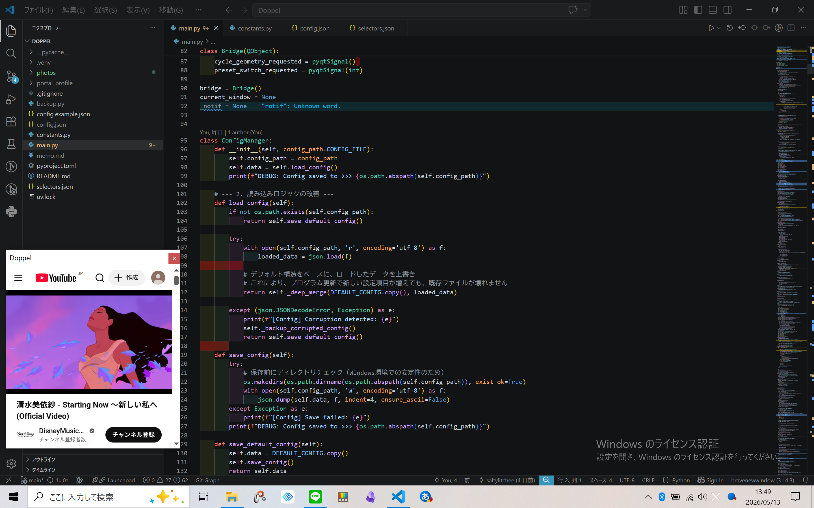
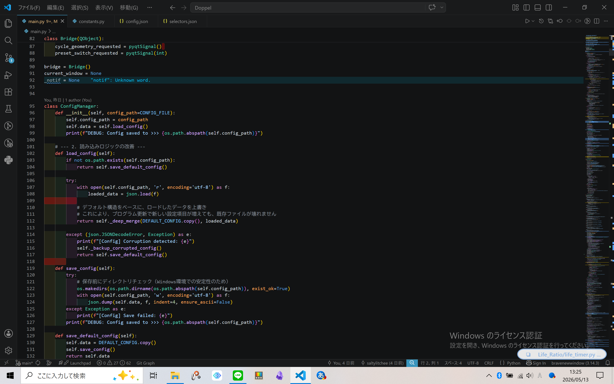
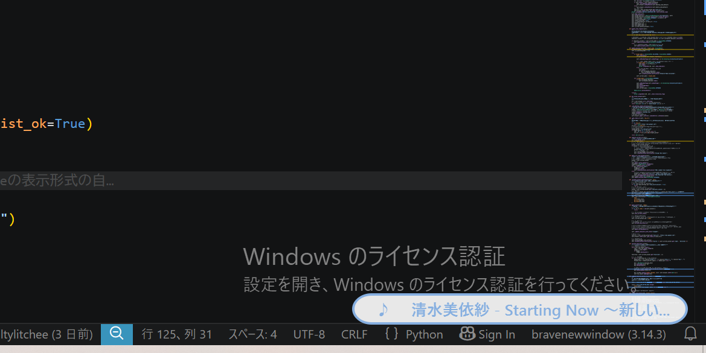

# Doppel

### プロジェクト概要
Doppelは、シングルディスプレイ環境での開発・学習効率を最大化するために設計された、補助的なWebブラウジングツールです。

名称の由来はドイツ語の「Doppel（2重、ペア）」から。参照したいWebサイトを即座に「分身」させ、常に最前面の小窓として配置することで、ウィンドウ切り替えによる思考の分断を防ぎます。

---

## 開発の背景と解決した課題

### 1. ターゲットとなる課題
プログラミング学習や実務において、エディタとブラウザを頻繁に行き来する際、以下の「不便」が発生していました。

- **配置のオーバーヘッド**: ウィンドウのサイズ調整や配置に時間を取られ、本来の作業フローが阻害される。
- **視線のスイッチングコスト**: 画面全体を切り替えるたびに参照箇所を見失い、情報の再認識に時間を要する。
- **一時的な情報の扱い**: 「今だけ確認したい」リファレンスのために、メインブラウザのタブやウィンドウを増やすことへの抵抗感。

### 2. Doppelによるアプローチ
参照したいURLを取得し、独立した軽量な小窓（最前面固定）として展開します。ユーザーの視界の端に情報を常に置いておくことで、最小限の視線移動だけでコードやドキュメントを参照できる「一時的かつ補助的な情報表示レイヤー」を提供します。

---

## 主要な機能

### 1. 3段階の表示ステート制御
作業の集中度や必要性に応じて、表示状態を切り替え可能です。

#### 小窓モード (Float)
最前面に固定され、エディタを隠さずにドキュメントを参照できます。

  
  
  
<i>エディタの横にリファレンスを配置し、視線移動を最小化している様子</i>

---

### 2. インジケーターとクイックコントロール
作業を邪魔しないよう画面端に最小化（常駐）させることができます。

#### インジケーターモード (Indicator)
特定のページでは、アイコンクリックのみで再生/停止などの操作が可能です。

  
  
  
<i>画面端に常駐するインジケーター。状況に合わせて視覚的に状態を確認できます</i>

---

## 技術的挑戦と課題解決プロセス

本プロジェクトでは、特に「不安定な入力デバイス環境における操作性の安定化」に注力しました。

### 1. トラックパッド入力の正規化 (Bootcamp環境への最適化)
**課題**:
MacBookをBootcampでWindows運用する特殊な環境下では、指を離す際（離指時）に物理法則を無視した巨大なスパイクノイズ（高頻度パルス）が発生し、意図しない「戻る・進む」が実行される課題がありました。

**解決策**:
- **時間軸フィルタリング (Duration Guard)**: 入力信号が一定時間（0.1秒以上）継続しない短時間のパルスをノイズとして破棄。
- **イベント密度サンプリング**: 一定時間内に一定数以上のイベントが連続している場合のみ有意な入力とみなす統計的フィルタを実装し、離指時のスパイクを論理的に遮断。

### 2. コンテキスト・ロック機構の実装
**課題**:
16文字以上のテキスト選択時にブラウザエンジンが「ドラッグ開始」と判定する挙動により、ジェスチャー判定が干渉を受けるエッジケースを確認しました。

**解決策**:
マウスボタンの状態（Press/Release）をフラグとして管理し、左ボタン押下中（テキスト選択中）はナビゲーション判定を物理的にロックする状態管理を導入しました。

---

## 今後の展望 (Roadmap)

現在は機能性と操作性の基盤が完成したフェーズであり、今後は以下の実装を予定しています。

### 1. プリセットシステムとURL連動の自動化
- 用途（例：Python学習、デザイン確認）に応じたプリセット切り替え機能。
- プリセットごとに最後に開いていたURLを自動展開するレジューム機能の実装。

### 2. 堅牢性の向上とリファクタリング
- **型ヒント (Type Hints) の導入**: `dict` や `List` 等の明示による保守性の向上。
- **設計の抽象化**: 信号整形を行う Preprocessor と、アクションを決定する GestureRecognizer への分離。

### 3. パッケージ化と配布
- PyInstallerを用いた実行ファイル (.exe) 形式へのパッケージ化。
- システムトレイ常駐化およびWindowsスタートアップ登録機能による、バックグラウンドでの安定動作。

---
